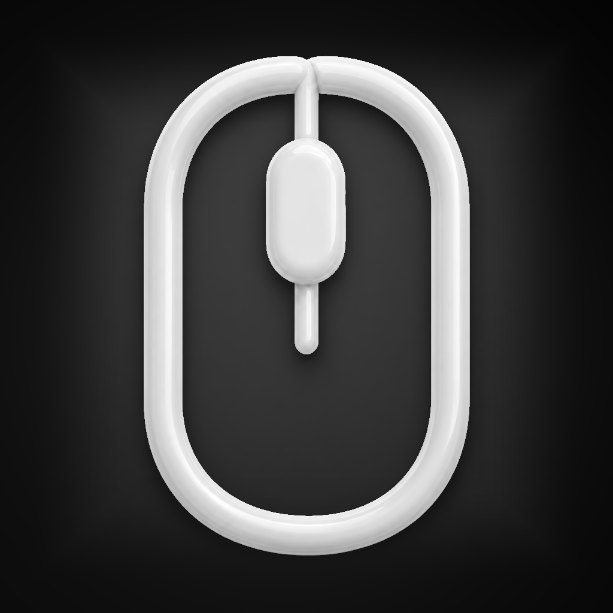

# MacScrollFix

<p align="center">
  
</p>

MacScrollFix, standart USB veya Bluetooth mouse tekerleğini Windows'taki alışılmış
yönde kullanmayı sağlayan, küçük ve tamamen yerel bir macOS menü çubuğu
uygulamasıdır. Harici mouse kaydırma yönünü düzeltirken MacBook trackpad
hareketlerini değiştirmez.

## Çözdüğü problem

macOS'in **Doğal kaydırma (Natural Scrolling)** ayarı trackpad için kullanışlıdır,
ancak aynı ayar standart bir mouse tekerleğini Windows'tan alışık olunan yönün
tersinde hissettirebilir. Sistem ayarını kapatmak trackpad davranışını da
değiştirdiği için MacScrollFix farklı bir yaklaşım kullanır:

- Standart mouse'tan gelen kesikli (**discrete**) scroll olaylarını tersine çevirir.
- Trackpad'den gelen sürekli (**continuous**) scroll olaylarını değiştirmeden geçirir.
- macOS'in genel kaydırma ayarına dokunmaz.

## Özellikler

- Yalnızca harici, standart mouse tekerleği yönünü düzeltir.
- Dikey ve yatay scroll deltalarını destekler.
- Trackpad kaydırmasını değiştirmez.
- Dock'ta görünmeden yalnızca menü çubuğunda çalışır.
- Düzeltme özelliği menüden anında açılıp kapatılabilir.
- Seçilen durum `UserDefaults` ile saklanır.
- macOS 13+ için **Girişte Başlat (Launch at Login)** desteği sunar.
- Erişilebilirlik iznini kontrol eder ve gerekli ayar sayfasını açabilir.
- Event tap sistem tarafından kapatılır veya geçersiz hâle gelirse tek kopya
  korunarak güvenli biçimde yeniden kurulur.
- Sorun giderme için yalnızca macOS birleşik günlük sistemine yerel teknik kayıt
  yazar; scroll içeriği kaydedilmez.
- İnternet bağlantısı veya üçüncü taraf bağımlılık kullanmaz.

## Sistem gereksinimleri

- macOS 13 Ventura veya daha yeni bir sürüm
- Xcode 26 veya daha yeni bir sürüm
- Standart tekerlekli USB veya Bluetooth mouse

## GitHub'dan indirip kurma

Bu proje Apple Developer ID sertifikası kullanmaz. Bu nedenle GitHub'dan alınan
hazır bir uygulama macOS tarafından otomatik olarak güvenilir sayılmaz. En güvenli
ücretsiz yöntem, kaynak kodunu Xcode ile kendi Mac'inizde derlemektir:

1. GitHub sayfasındaki **Code > Download ZIP** seçeneğine basın.
2. İnen ZIP dosyasını çift tıklayarak açın.
3. `MacScrollFix.xcodeproj` dosyasını çift tıklayın.
4. Xcode'un üst kısmında scheme olarak **MacScrollFix**, aygıt olarak
   **My Mac** seçildiğini kontrol edin.
5. `Command + B` tuşlarına basarak uygulamayı derleyin.
6. Xcode'un sol tarafındaki **Products > MacScrollFix.app** öğesine sağ tıklayıp
   **Show in Finder** seçeneğine basın.
7. `MacScrollFix.app` dosyasını **Applications (Uygulamalar)** klasörüne sürükleyin.
8. Uygulamayı Applications klasöründen açın ve Erişilebilirlik iznini verin.

Ücretsiz Apple hesabı yerel derleme için yeterlidir; ücretli Apple Developer
üyeliği gerekmez. Xcode imzalama uyarısı gösterirse **TARGETS > MacScrollFix >
Signing & Capabilities** bölümünden kişisel Apple hesabınıza ait **Team** seçilebilir.

## Xcode ile geliştirme

1. Proje klasörünü Mac'inize indirin veya Git ile klonlayın.
2. `MacScrollFix.xcodeproj` dosyasını Xcode ile açın.
3. Scheme olarak **MacScrollFix**, hedef aygıt olarak **My Mac** seçin.
4. **Run** düğmesine basın veya `Command + R` kullanın.
5. Menü çubuğundaki mouse simgesini bulun.

Komut satırından kod imzası olmadan Debug derlemesi almak için:

```sh
xcodebuild \
  -project MacScrollFix.xcodeproj \
  -scheme MacScrollFix \
  -configuration Debug \
  -destination 'platform=macOS' \
  -derivedDataPath build/DerivedData \
  CODE_SIGNING_ALLOWED=NO \
  build
```

Derlenen `.app` dosyasını kalıcı kullanmak için Xcode'daki **Products >
MacScrollFix.app** öğesine sağ tıklayın, **Show in Finder** seçeneğini kullanın ve
uygulamayı `/Applications` klasörüne kopyalayın.

## Kullanım

Menü çubuğundaki MacScrollFix simgesine tıklayın:

- **Mouse Scroll Düzeltme:** Özelliği açar veya kapatır.
- **Aktif / Kapalı:** Düzeltmenin mevcut çalışma durumunu ve gerekiyorsa eksik
  Erişilebilirlik iznini gösterir.
- **Girişte Başlat:** MacScrollFix'i kullanıcı oturumu açıldığında başlatır.
- **Erişilebilirlik Ayarlarını Aç:** Gerekli macOS izin sayfasını açar.
- **MacScrollFix'ten Çık:** Event tap'i temizleyerek uygulamayı kapatır.

Dolu mouse simgesi düzeltmenin çalıştığını, soluk ve boş simge ise özelliğin kapalı
olduğunu veya iznin eksik olduğunu gösterir.

## Erişilebilirlik izni

MacScrollFix, sistem genelindeki scroll olaylarını değiştirmek için macOS
**Erişilebilirlik (Accessibility)** iznine ihtiyaç duyar.

1. MacScrollFix'i ilk kez çalıştırın ve macOS izin isteğini onaylayın.
2. Gerekirse menüden **Erişilebilirlik Ayarlarını Aç** seçeneğine basın.
3. **Sistem Ayarları > Gizlilik ve Güvenlik > Erişilebilirlik** bölümünde
   MacScrollFix'i etkinleştirin.

Listede görünmüyorsa `+` düğmesiyle `MacScrollFix.app` dosyasını ekleyin. Uygulamayı
yeniden derledikten veya başka bir klasöre taşıdıktan sonra macOS izni tekrar
isteyebilir.

## Girişte başlatma

Menüdeki **Girişte Başlat** seçeneği macOS 13 ve sonrasındaki
`SMAppService.mainApp` API'sini kullanır. macOS ek onay isterse
**Sistem Ayarları > Genel > Giriş Öğeleri** bölümünden MacScrollFix'e izin verin.

## Teknik çalışma şekli

MacScrollFix, Core Graphics `CGEventTap` ile yalnızca `scrollWheel` olaylarını yakalar:

- `scrollWheelEventIsContinuous == 0`: Standart fiziksel mouse kabul edilir ve
  dikey/yatay delta alanları tersine çevrilir.
- `scrollWheelEventIsContinuous != 0`: Trackpad kabul edilir ve olay değiştirilmeden
  hedef uygulamaya iletilir.

Olayın diğer özellikleri korunur. Global event değiştirme sandbox içinde güvenilir
biçimde çalışmadığı için **App Sandbox** bilinçli olarak kapalıdır; uygulama yine de
yalnızca scroll olaylarını yerel olarak işler.

Tap'in kurulmuş görünmesi tek başına yeterli kabul edilmez. MacScrollFix tap'in
geçerli ve etkin olduğunu düzenli olarak kontrol eder; sağlıksızsa eski kaynağı
tamamen temizleyip yalnızca bir yeni tap oluşturur.

## Kullanılan teknolojiler

- Swift
- SwiftUI ve AppKit
- Core Graphics `CGEventTap`
- ApplicationServices
- ServiceManagement
- XCTest

Üçüncü taraf paket veya bağımlılık kullanılmaz.

## Proje yapısı

```text
MacScrollFix.xcodeproj/                 Xcode proje ve paylaşılan scheme dosyaları
MacScrollFix/
├── MacScrollFixApp.swift               Menü çubuğu arayüzü ve uygulama yaşam döngüsü
├── MacScrollFixModel.swift             Durum, izin ve Launch at Login yönetimi
├── EventTapManager.swift             Global CGEventTap kurulumu ve temizliği
├── ScrollEventTransformer.swift      Discrete/continuous ayrımı ve delta dönüşümü
├── AppIcon.icon/                     Modern macOS uygulama ikonu
└── Info.plist                        Uygulama bundle ayarları
MacScrollFixTests/
└── ScrollEventTransformerTests.swift
```

## Testler

Xcode'da `Command + U` kullanabilir veya terminalde şu komutu çalıştırabilirsiniz:

```sh
xcodebuild \
  -project MacScrollFix.xcodeproj \
  -scheme MacScrollFix \
  -configuration Debug \
  -destination 'platform=macOS' \
  -derivedDataPath build/DerivedData \
  CODE_SIGNING_ALLOWED=NO \
  test
```

Birim testleri discrete dikey/yatay/üçüncü eksen delta dönüşümünü, continuous
olayların değişmeden geçmesini, olay sınıflandırmasını ve çift dönüşümün özgün
değerleri geri getirmesini doğrular. Gerçek mouse, trackpad, Safari, Finder ve
Chrome davranışı ayrıca elle test edilmelidir.

## Gizlilik

MacScrollFix:

- İnternet bağlantısı kullanmaz.
- Kullanıcı hesabı veya uzak servis içermez.
- Kullanıcı verisi toplamaz, saklamaz veya paylaşmaz.
- Scroll olaylarını yalnızca cihaz üzerinde (**on-device**) ve anlık olarak işler.
- Yerel teknik günlükler scroll değerlerini veya kullanıcı içeriğini kaydetmez.
- macOS'in genel Natural Scrolling ayarını değiştirmez.

## Bilinen sınırlamalar

- Standart, kesikli scroll olayı üreten fiziksel USB/Bluetooth mouse'lar hedeflenir.
- Magic Mouse ve bazı yüksek çözünürlüklü mouse'lar trackpad benzeri continuous
  olay üretebilir. Bu aygıtlar güvenli tarafta kalmak için trackpad gibi
  değerlendirilir ve yönleri değiştirilmez.
- Fiziksel aygıt davranışı yalnızca otomatik birim testleriyle tamamen
  doğrulanamaz.

## Katkıda bulunma

Hata raporları ve iyileştirme katkıları kabul edilir. Geliştirme akışı ve pull
request beklentileri için [CONTRIBUTING.md](CONTRIBUTING.md) dosyasını okuyun.

## Lisans

Bu proje [MIT Lisansı](LICENSE) ile sunulmaktadır.
