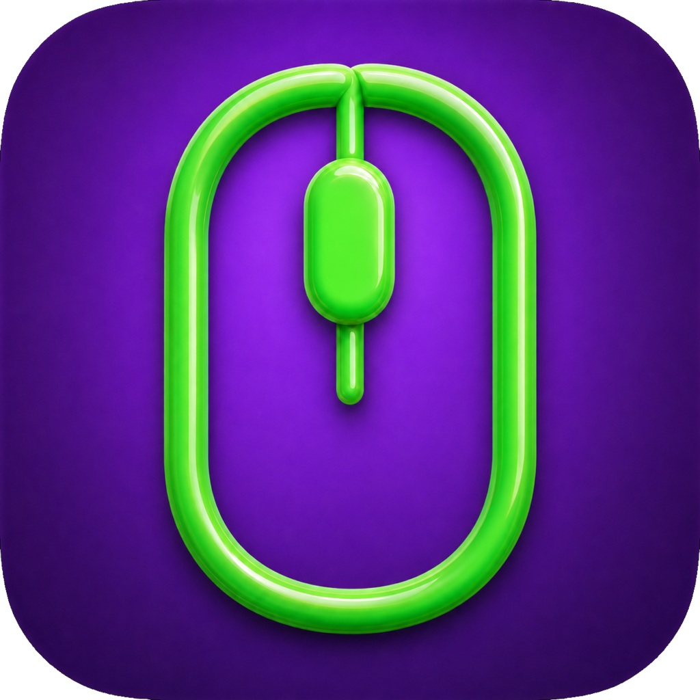

# ScrollFix

<p align="center">
  
</p>

ScrollFix, standart USB veya Bluetooth mouse tekerleğini Windows'taki alışılmış
yönde kullanmayı sağlayan, küçük ve tamamen yerel bir macOS menü çubuğu
uygulamasıdır. Harici mouse kaydırma yönünü düzeltirken MacBook trackpad
hareketlerini değiştirmez.

## Çözdüğü problem

macOS'in **Doğal kaydırma (Natural Scrolling)** ayarı trackpad için kullanışlıdır,
ancak aynı ayar standart bir mouse tekerleğini Windows'tan alışık olunan yönün
tersinde hissettirebilir. Sistem ayarını kapatmak trackpad davranışını da
değiştirdiği için ScrollFix farklı bir yaklaşım kullanır:

- Standart mouse'tan gelen kesikli (**discrete**) scroll olaylarını tersine çevirir.
- Trackpad'den gelen sürekli (**continuous**) scroll olaylarını değiştirmeden geçirir.
- macOS'in genel kaydırma ayarına dokunmaz.

## Özellikler

- Yalnızca harici, standart mouse tekerleği yönünü düzeltir.
- Dikey ve yatay scroll deltalarını destekler.
- Trackpad kaydırmasını değiştirmez.
- Dock'ta görünmeden yalnızca menü çubuğunda çalışır.
- Düzeltme özelliği menüden anında açılıp kapatılabilir.
- Seçilen durum `UserDefaults` ile saklanır.
- macOS 13+ için **Girişte Başlat (Launch at Login)** desteği sunar.
- Erişilebilirlik iznini kontrol eder ve gerekli ayar sayfasını açabilir.
- Event tap sistem tarafından kapatılırsa güvenli biçimde yeniden etkinleştirir.
- İnternet bağlantısı veya üçüncü taraf bağımlılık kullanmaz.

## Sistem gereksinimleri

- macOS 13 Ventura veya daha yeni bir sürüm
- Xcode 14 veya daha yeni bir sürüm
- Standart tekerlekli USB veya Bluetooth mouse

## Kurulum ve Xcode ile çalıştırma

1. Proje klasörünü Mac'inize indirin veya Git ile klonlayın.
2. `ScrollFix.xcodeproj` dosyasını Xcode ile açın.
3. Scheme olarak **ScrollFix**, hedef aygıt olarak **My Mac** seçin.
4. **Run** düğmesine basın veya `Command + R` kullanın.
5. Menü çubuğundaki mouse simgesini bulun.

İlk derlemede imzalama uyarısı görülürse **TARGETS > ScrollFix > Signing &
Capabilities** bölümünden kendi Apple hesabınıza ait bir **Team** seçebilirsiniz.
Yerel geliştirme için ücretli Apple Developer üyeliği gerekmez.

Komut satırından kod imzası olmadan Debug derlemesi almak için:

```sh
xcodebuild \
  -project ScrollFix.xcodeproj \
  -scheme ScrollFix \
  -configuration Debug \
  -destination 'platform=macOS' \
  -derivedDataPath build/DerivedData \
  CODE_SIGNING_ALLOWED=NO \
  build
```

Derlenen `.app` dosyasını kalıcı kullanmak için Xcode'daki **Products >
ScrollFix.app** öğesine sağ tıklayın, **Show in Finder** seçeneğini kullanın ve
uygulamayı `/Applications` klasörüne kopyalayın.

## Kullanım

Menü çubuğundaki ScrollFix simgesine tıklayın:

- **Mouse Scroll Düzeltme:** Özelliği açar veya kapatır.
- **Aktif / Kapalı:** Düzeltmenin mevcut çalışma durumunu gösterir.
- **Girişte Başlat:** ScrollFix'i kullanıcı oturumu açıldığında başlatır.
- **Erişilebilirlik Ayarlarını Aç:** Gerekli macOS izin sayfasını açar.
- **ScrollFix'ten Çık:** Event tap'i temizleyerek uygulamayı kapatır.

Dolu mouse simgesi düzeltmenin çalıştığını, soluk ve boş simge ise özelliğin kapalı
olduğunu veya iznin eksik olduğunu gösterir.

## Erişilebilirlik izni

ScrollFix, sistem genelindeki scroll olaylarını değiştirmek için macOS
**Erişilebilirlik (Accessibility)** iznine ihtiyaç duyar.

1. ScrollFix'i ilk kez çalıştırın.
2. İzin açıklamasındaki **Ayarları Aç** düğmesine basın.
3. **Sistem Ayarları > Gizlilik ve Güvenlik > Erişilebilirlik** bölümünü açın.
4. ScrollFix'i etkinleştirin.

Listede görünmüyorsa `+` düğmesiyle `ScrollFix.app` dosyasını ekleyin. Uygulamayı
yeniden derledikten veya başka bir klasöre taşıdıktan sonra macOS izni tekrar
isteyebilir.

## Girişte başlatma

Menüdeki **Girişte Başlat** seçeneği macOS 13 ve sonrasındaki
`SMAppService.mainApp` API'sini kullanır. macOS ek onay isterse
**Sistem Ayarları > Genel > Giriş Öğeleri** bölümünden ScrollFix'e izin verin.

## Teknik çalışma şekli

ScrollFix, Core Graphics `CGEventTap` ile yalnızca `scrollWheel` olaylarını yakalar:

- `scrollWheelEventIsContinuous == 0`: Standart fiziksel mouse kabul edilir ve
  dikey/yatay delta alanları tersine çevrilir.
- `scrollWheelEventIsContinuous != 0`: Trackpad kabul edilir ve olay değiştirilmeden
  hedef uygulamaya iletilir.

Olayın diğer özellikleri korunur. Global event değiştirme sandbox içinde güvenilir
biçimde çalışmadığı için **App Sandbox** bilinçli olarak kapalıdır; uygulama yine de
yalnızca scroll olaylarını yerel olarak işler.

## Kullanılan teknolojiler

- Swift
- SwiftUI ve AppKit
- Core Graphics `CGEventTap`
- ApplicationServices
- ServiceManagement
- XCTest

Üçüncü taraf paket veya bağımlılık kullanılmaz.

## Proje yapısı

```text
ScrollFix.xcodeproj/                 Xcode proje ve paylaşılan scheme dosyaları
ScrollFix/
├── ScrollFixApp.swift               Menü çubuğu arayüzü ve uygulama yaşam döngüsü
├── ScrollFixModel.swift             Durum, izin ve Launch at Login yönetimi
├── EventTapManager.swift            Global CGEventTap kurulumu ve temizliği
├── ScrollEventTransformer.swift     Discrete/continuous ayrımı ve delta dönüşümü
├── Assets.xcassets/                 AppIcon kaynakları
├── Info.plist                       Uygulama bundle ayarları
└── ScrollFix.entitlements           Entitlement yapılandırması
ScrollFixTests/
└── ScrollEventTransformerTests.swift
```

## Testler

Xcode'da `Command + U` kullanabilir veya terminalde şu komutu çalıştırabilirsiniz:

```sh
xcodebuild \
  -project ScrollFix.xcodeproj \
  -scheme ScrollFix \
  -configuration Debug \
  -destination 'platform=macOS' \
  -derivedDataPath build/DerivedData \
  CODE_SIGNING_ALLOWED=NO \
  test
```

Birim testleri discrete dikey/yatay delta dönüşümünü, continuous olayların
değişmeden geçmesini ve olay sınıflandırmasını doğrular. Gerçek mouse, trackpad,
Safari, Finder ve Chrome davranışı ayrıca elle test edilmelidir.

## Gizlilik

ScrollFix:

- İnternet bağlantısı kullanmaz.
- Kullanıcı hesabı veya uzak servis içermez.
- Kullanıcı verisi toplamaz, saklamaz veya paylaşmaz.
- Scroll olaylarını yalnızca cihaz üzerinde (**on-device**) ve anlık olarak işler.
- macOS'in genel Natural Scrolling ayarını değiştirmez.

## Bilinen sınırlamalar

- Standart, kesikli scroll olayı üreten fiziksel USB/Bluetooth mouse'lar hedeflenir.
- Magic Mouse ve bazı yüksek çözünürlüklü mouse'lar trackpad benzeri continuous
  olay üretebilir. Bu aygıtlar güvenli tarafta kalmak için trackpad gibi
  değerlendirilir ve yönleri değiştirilmez.
- Fiziksel aygıt davranışı yalnızca otomatik birim testleriyle tamamen
  doğrulanamaz.

## Katkıda bulunma

Hata raporları ve iyileştirme katkıları kabul edilir. Geliştirme akışı ve pull
request beklentileri için [CONTRIBUTING.md](CONTRIBUTING.md) dosyasını okuyun.

## Lisans

Bu proje [MIT Lisansı](LICENSE) ile sunulmaktadır.
